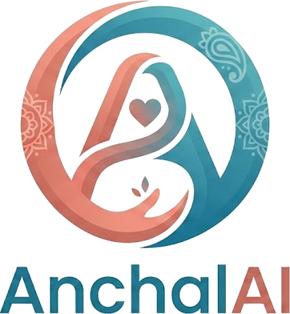
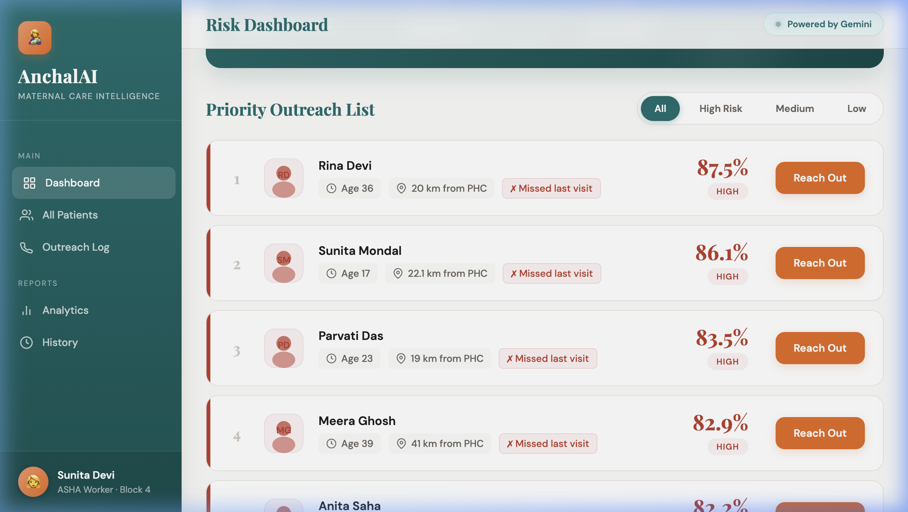
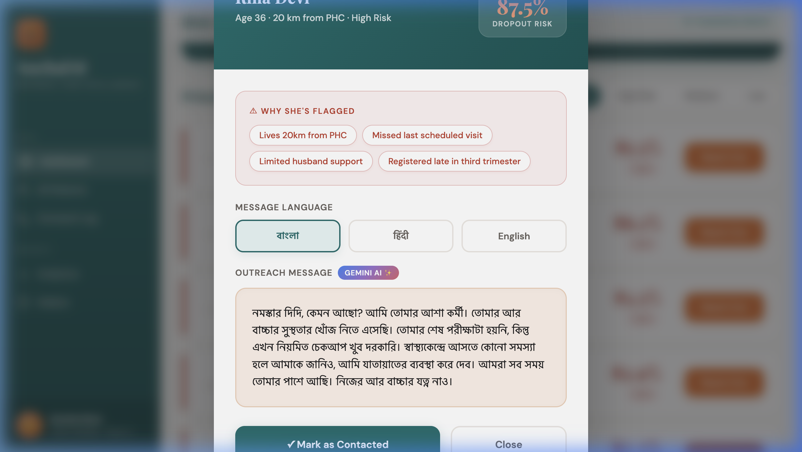

<p align="center">
  
</p>

<h1 align="center">🤱 AnchalAI — Maternal Care Intelligence</h1>

<p align="center">
  <em>Every mother deserves Anchal.</em>
</p>

<p align="center">
  
  
  
  
  
  
</p>

---

## 🚨 The Problem

India loses over **24,000 mothers every year** to complications that are almost entirely preventable. The tragedy is not that these women never sought care — most of them *did* register for antenatal visits at their local Primary Health Centre. But somewhere between the first registration and the critical later visits, they silently dropped out. A young woman walks 18 kilometers to register in her third trimester, misses her next appointment during harvest season, and never returns. No one notices until it is too late.

ASHA workers — the incredible frontline health volunteers who serve rural India — carry the weight of this crisis on paper registers and memory. They have no way to know which of their 200+ registered women is about to disappear, no way to prioritize who needs a home visit *today*, and no tools to communicate in the woman's own language with the right cultural sensitivity. **AnchalAI changes that.**

---

## 💡 What AnchalAI Does

AnchalAI is an end-to-end **AI-powered maternal care intelligence platform** that predicts which pregnant women are at risk of dropping out of antenatal care *before* they disappear — and equips ASHA workers with the exact words to bring them back.

At its core sits a **Random Forest classifier** trained on demographic, geographic, and behavioral features — age, distance from the nearest PHC, literacy, husband support, missed visits, harvest season, and more. The model scores every registered woman with a dropout risk percentage, and the dashboard surfaces them in priority order so the ASHA worker knows exactly who to visit first.

But prediction alone isn't enough. When an ASHA worker taps "Reach Out" on a high-risk woman, AnchalAI's **multi-agent AI pipeline** — built on Google's Agent Development Kit (ADK) — springs into action. The **RiskAnalystAgent** runs the ML model, the **CommunicationAgent** uses Gemini to craft a warm, culturally appropriate outreach message in **Bengali, Hindi, or English**, adjusting tone for age, literacy, and family dynamics. The **EscalationAgent** determines the right follow-up action: a routine check-in, an urgent home visit, or an immediate PHC alert.

The result is a complete **Care Action Plan** — risk score, human-readable risk factors, a vernacular message ready to send, and a clear escalation decision — delivered to the ASHA worker's dashboard in seconds.

---

## 📸 Screenshots

### ASHA Worker Dashboard — Priority Outreach List

The dashboard surfaces the highest-risk women first. Each card shows the woman's age, distance from PHC, missed visits, and a bold risk percentage. The ASHA worker simply taps **"Reach Out"** to trigger the AI pipeline.

<p align="center">
  
</p>

### Gemini-Powered Bengali Outreach Message

When "Reach Out" is tapped, AnchalAI shows *why* the woman was flagged (distance, missed visits, limited husband support), lets the ASHA worker choose a language, and generates a **Gemini-powered outreach message** in Bengali — warm, simple, culturally sensitive, and ready to send.

<p align="center">
  
</p>

---

## 🏗️ Architecture

```
ASHA Worker → Dashboard → Flask API → ML Model (Random Forest)
                                    ↓
                              ADK Agent Pipeline
                RiskAnalystAgent → CommunicationAgent → EscalationAgent
                                    ↓
                         Gemini (Vertex AI) → Bengali/Hindi/English Message
```

The system runs as two Cloud Run services:

- **Backend API** — Flask app serving the ML model and Gemini message generation for the dashboard
- **ADK Agent** — FastAPI app exposing the full multi-agent pipeline as a single `/predict` endpoint

Both are containerized with Docker, deployed to **Google Cloud Run** (asia-south1), and the frontend is hosted on **GitHub Pages**.

---

## 🛠️ Tech Stack

| Layer | Technology |
|-------|-----------|
| **AI / LLM** | Google Gemini 2.0 Flash, Google ADK (Agent Development Kit) |
| **ML Model** | scikit-learn Random Forest, pandas |
| **Agent Orchestration** | Google ADK SequentialAgent (RiskAnalyst → Communication → Escalation) |
| **Backend** | Flask (dashboard API), FastAPI (agent endpoint) |
| **Infrastructure** | Google Cloud Run, Vertex AI, Docker |
| **Frontend** | HTML/CSS/JS, GitHub Pages |
| **Language** | Python 3.11 |

---

## 🔗 Live Links

| Service | URL |
|---------|-----|
| 🌐 **Dashboard** | [mrmallick07.github.io/AnchalAI](https://mrmallick07.github.io/AnchalAI/) |
| ⚙️ **Backend API** | [anchalai-backend-961197586142.asia-south1.run.app](https://anchalai-backend-961197586142.asia-south1.run.app) |
| 🤖 **ADK Agent** | [anchalai-agent-961197586142.asia-south1.run.app](https://anchalai-agent-961197586142.asia-south1.run.app) |

**Test the agent directly:**

```bash
curl -X POST https://anchalai-agent-961197586142.asia-south1.run.app/predict \
  -H "Content-Type: application/json" \
  -d '{
    "age": 19,
    "distance_to_phc_km": 18.5,
    "previous_pregnancies": 1,
    "attended_last_visit": 0,
    "household_income_level": 1,
    "husband_support": 0,
    "literacy": 0,
    "trimester_at_registration": 3,
    "harvest_season": 1,
    "asha_visits_so_far": 1,
    "language": "Bengali"
  }'
```

---

## 🚀 Local Setup

```bash
# Clone the repository
git clone https://github.com/mrmallick07/AnchalAI.git
cd AnchalAI

# Create and activate virtual environment
python3 -m venv venv
source venv/bin/activate

# Install dependencies
pip install -r requirements.txt

# Add your Gemini API key
echo "GEMINI_API_KEY=your_api_key_here" > .env

# Run the Flask backend (dashboard API)
python app.py

# Or run the ADK agent endpoint
python -m agent.main
```

The Flask app runs on `http://localhost:8080`. The agent endpoint also runs on port 8080.

To get a Gemini API key, visit [aistudio.google.com/apikey](https://aistudio.google.com/apikey).

---

## 👨‍💻 Built By

**Hannan Ali Mallick**

📧 [hannanmallick07@gmail.com](mailto:hannanmallick07@gmail.com)
📞 +91 7003711453
🔗 [linkedin.com/in/hannan-ali-mallick](https://www.linkedin.com/in/hannan-ali-mallick)

---

<p align="center">
  <em>Built with ❤️ for the mothers of India.</em>
</p>
